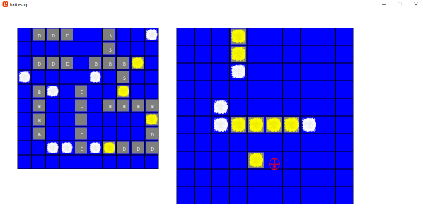

# Battleship

Implementation of the classic pen-and-paper/plastic guessing game. Each player has a ten by ten grid on which to place their ships in the first phase: 1 Carrier, 3 Battleships, 4 Destroyers, and 2 Submarines (Numbers selected arbitarily). No sound and only simple graphics, but still a fun exercise.

Each game turn, alternating players pick a shot on the other players board until one player has lost all their ships, leaving the other the winner. For this implementation one player is human, and the other AI.

Built in F#, referencing a MonoGame library I have built.

## To run

The repo contains two projects: game-core and battleship. The first is the monogame bits, used as a library by the main project 'battleship'. In order to run the game, you need to run 'dotnet run' from the battleship folder, or specify the project via `dotnet run -p ./battleship/battleship.fsproj`

## Supported platforms

Being dotnet core 2.1, it should work on all platforms that supports (Windows, Linux, Mac). Tested (and largely coded on) Windows 10. A full list of dotnet core supported platforms can be found from here: <https://github.com/dotnet/core/blob/master/release-notes/2.1/2.1-supported-os.md>

I built this using VS Code, but have also tested opening and running on Visual Studio 2017.

A note for mac users: part of the compilation of this game involves building the content, done using a MonoGame content builder referenced via Nuget. On OSX, this component does not work with just dotnet core. I have managed to get it going by doing the following:

- Installing the latest version of LTS Mono from here (version 5.12.0): <http://www.mono-project.com/download/stable/#download-mac>
- Installing the latest version of the MonoGame standalone pipeline builder for OSX from here (Pipeline.MacOS.pkg, v3.6): <http://www.monogame.net/2017/03/01/monogame-3-6/>
- Doing a sudo dotnet restore and a sudo dotnet build

After the build succeeded, a sudo dotnet run started the game without issue.

## Note on development sequence

This project was the first developed after the __Realm of FSharp exercises__ [here](https://github.com/ChrisPritchard/RealmOfFSharp).

The next project developed after this, and using the lessons learned, was __Tetris__ [here](https://github.com/ChrisPritchard/Tetris).